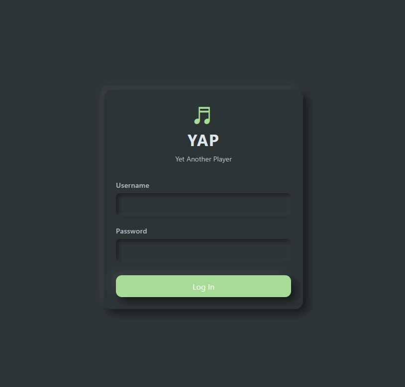
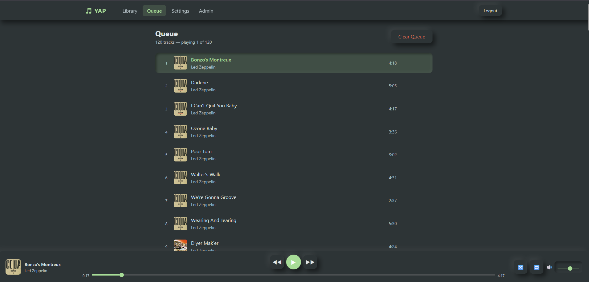
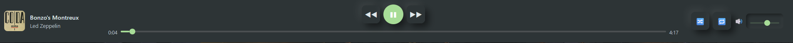
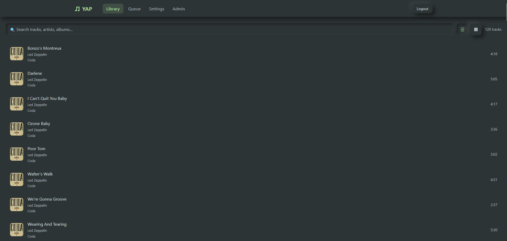

# Yet Another Player (YAP)

[](https://opensource.org/licenses/MIT)

YAP is a free and open-source, self-hosted media player and server, with a focus on music. The goal of this application is to allow people to host music and media on local networks that do not have access to a WAN (Offline).

### Personal Statement on the purpose of this project

I often find myself camping or in areas with limited internet access, but still want to play music or video from mulitple devices, or provide tabs/sheet music for during a jam session. 

In the past I have used a combination of different apps such as Jellyfin and Navidrome running on a Pi Router. It felt inconvenient to navigate manually between the pages, which lead me to writing a simple webpage to stitch them together with redirects. After that I figured I wanted a way to host and share music sheets and tabs when going to a jam, so I wrote a PHP web application I called "MusicBox". This app added redirect links to video and music servers, and hosted a dynamic list of guitar and harmonica tabs that could be added to with text files through FTP. Ultimately it was clunky and ugly. 

With YAP I am aiming to streamline that into a single application that meets my niche needs.


## Features

- **Self-hosted:** Host your own music server on your own hardware.
- **Offline First:** Designed to work on local networks without an internet connection.
- **Web-based UI:** Modern and responsive web interface to access your music.
- **Music Library:** Scan and import your music library.
- **Audio Streaming:** Stream music directly from your server to your browser.
- **User Authentication:** Protect your music library with a username and password.
- **Album Art:** Automatically scrapes album art for your music.
- **Queue Management:** Queue up tracks to play next. (Coming Soon)

## TODO 

* ~~Album Art scraping and display on tracks~~ - Finished 
* Add more in depth queue management 
* Selected theme persistence
* Video/Podcast Player
* Music Tabs & Embedded Sheet Music

## Tech Stack

### Backend

- [Node.js](https://nodejs.org/)
- [Express](https://expressjs.com/)
- [NeDB](https://github.com/louischatriot/nedb) (for database)
- [music-metadata](https://github.com/Borewit/music-metadata) (for reading music metadata)

### Frontend

- [Vue.js](https://vuejs.org/)
- [Vite](https://vitejs.dev/)
- [Vue Router](https://router.vuejs.org/)
- [Pinia](https://pinia.vuejs.org/)
- [Axios](https://axios-http.com/)

### Containerization

- [Docker](https://www.docker.com/)
- [Docker Compose](https://docs.docker.com/compose/)

## Getting Started

### Prerequisites

- [Node.js](https://nodejs.org/) (v14 or higher)
- [Docker](https://www.docker.com/get-started) (for containerized deployment)

### Installation (Docker)

The easiest way to get started is with Docker Compose.

1.  Clone the repository:
    ```bash
    git clone https://github.com/your-username/YAP.git
    cd YAP
    ```
2.  Create a `music` directory and add your music files:
    ```bash
    mkdir music
    ```
3.  Run the application using Docker Compose:
    ```bash
    docker-compose up -d
    ```
4.  The application will be available at `http://localhost:8080`.

### Installation (Local Development)

1.  Clone the repository:
    ```bash
    git clone https://github.com/your-username/YAP.git
    cd YAP
    ```
2.  Install dependencies for both the backend and frontend:
    ```bash
    npm install
    ```
3.  Start the development servers:
    ```bash
    npm run dev
    ```
4.  The frontend will be available at `http://localhost:5173` (or another port if 5173 is busy) and the backend at `http://localhost:3000`.

## Project Structure

```
.
├── backend/            # Node.js backend
│   ├── src/
│   │   ├── routes/     # API routes
│   │   ├── services/   # Business logic
│   │   ├── middleware/ # Express middleware
│   │   └── index.js    # Backend entrypoint
│   └── package.json
├── frontend/           # Vue.js frontend
│   ├── src/
│   │   ├── components/ # Vue components
│   │   ├── views/      # Vue views (pages)
│   │   ├── router/     # Vue router setup
│   │   ├── stores/     # Pinia stores
│   │   └── main.js     # Frontend entrypoint
│   └── package.json
├── docker-compose.yml  # Docker Compose configuration
└── README.md
```

## Images of V1
#### Login Screen

#### Queue Screen

#### Music Player

#### Library Screen


## Contributing

Contributions are welcome! Please feel free to submit a pull request or open an issue.